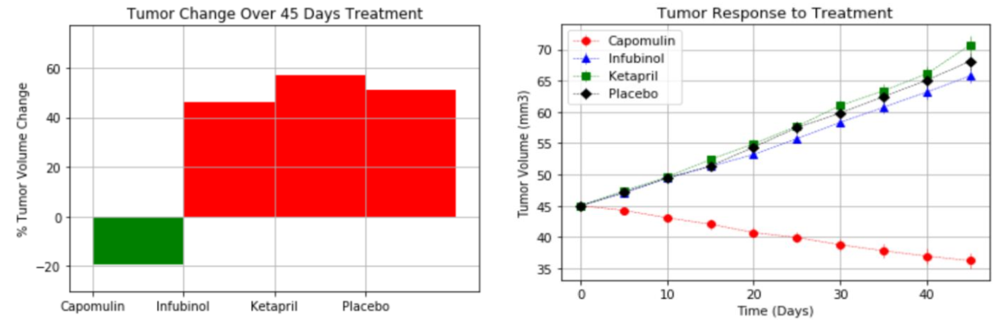
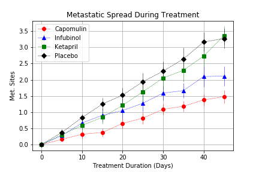
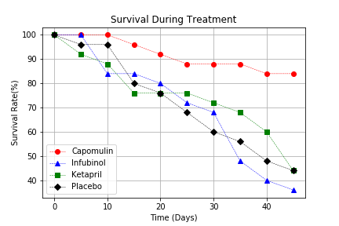

# Matplotlib: Analysis of drug to fight cancer
#### Exercise Performed for the Coding BootCamp in Rutgers University, New Jersey 

## About

With access to the complete data from their most recent animal study by a Pharmaceutical. In this study, 250 mice were treated through a variety of drug regimes over the course of 45 days. Their physiological responses were then monitored over the course of that time. 

The objective of this exercise is to analyze the data to show how four treatments (Capomulin, Infubinol, Ketapril, and Placebo) compare.

Technology Used:

Python:
* Libraries: Pandas ans Numpy

 

## Analysis
 
Observation 1:
 

 According to the previous graphs, it is evident that the drug "Capomulin" is generating a
positive response in the reduction of the size of the cancer tumor. After 45 days of the
mice being exposed to the drug, the average reduction observed in tumor size is -19.475303%.

 
Observation 2:
 

 Taking into account the graph: "Metastatic Spread During Treatment", mice that received
"Capomulin" show less spread of cancer during the time the medication was delivered.

 
Observation 3:
 

 The survival rate of mice during the 45 days of treatment is higher in mice that received
the drug "Capomulin" compared to mice that received the other drugs.

 

## Conclusion
Taking into account the evidence observed throughout the assignment, it could be
concluded that the drug "Capomulin" could be good medicine in favor of the fight against
cancer.
